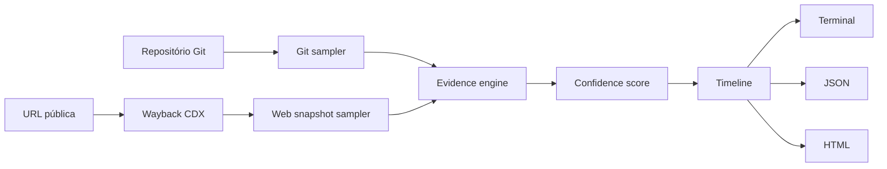

<a id="readme-top"></a>

<div align="center">
  <h1>CodeStrata</h1>

  <p>
    Arqueologia de software para reconstruir a evolução tecnológica de repositórios Git e sites arquivados.
  </p>

  <p>
    
    
    
  </p>

  <p>
    <a href="https://jeffersontadeu.vercel.app">
      
    </a>
    <a href="https://github.com/auhauhbr">
      
    </a>
    <a href="https://www.linkedin.com/in/jefferson-tadeu-dos-santos-0ab133380">
      
    </a>
  </p>

  <p>
    
    
    
    
    
    
    
  </p>
</div>

> [!NOTE]
> O CodeStrata está funcional como aplicação de linha de comando. O projeto analisa
> repositórios sem executar o código avaliado e também reconstrói sinais de
> tecnologias client-side a partir de capturas históricas da Wayback Machine.

## Sumário

- [Visão geral](#visão-geral)
- [Funcionalidades](#funcionalidades)
- [Como funciona](#como-funciona)
- [Evidências e confiança](#evidências-e-confiança)
- [Tecnologias detectadas](#tecnologias-detectadas)
- [Segurança e princípio read-only](#segurança-e-princípio-read-only)
- [Relatórios](#relatórios)
- [Estrutura do projeto](#estrutura-do-projeto)
- [Requisitos](#requisitos)
- [Instalação local](#instalação-local)
- [Uso com repositórios Git](#uso-com-repositórios-git)
- [Uso com a Wayback Machine](#uso-com-a-wayback-machine)
- [Testes e CI](#testes-e-ci)
- [Limitações conhecidas](#limitações-conhecidas)
- [Licença](#licença)
- [Autor](#autor)

## Visão geral

O CodeStrata é uma ferramenta de **software archaeology** que reconstrói como a
stack de um projeto mudou ao longo do tempo.

Em vez de olhar apenas para o estado atual de um repositório, a ferramenta
seleciona pontos representativos do histórico Git, examina os arquivos daquele
momento e produz uma timeline das tecnologias encontradas. Também existe um
modo de arqueologia web, que consulta capturas históricas da Internet Archive e
procura sinais tecnológicos preservados no HTML arquivado.

O fluxo principal pode ser resumido assim:

```text
Histórico Git / Wayback
        ↓
Amostragem temporal
        ↓
Coleta de evidências
        ↓
Pontuação de confiança
        ↓
Timeline tecnológica
        ↓
Terminal + JSON + HTML
```

O objetivo não é adivinhar a stack. Cada detecção é acompanhada pela evidência
que a originou, como dependências de manifestos, arquivos de configuração,
lockfiles, assinaturas no código ou assets encontrados em páginas arquivadas.

## Funcionalidades

### Arqueologia de repositórios Git

- análise de repositórios locais ou URLs Git remotas;
- leitura do histórico sem checkout destrutivo do diretório de trabalho;
- amostragem por ano, trimestre ou mês;
- limite configurável de snapshots históricos;
- detecção de tecnologias por manifestos, lockfiles, configuração, estrutura e
  assinaturas de código;
- extração de versões quando a evidência permite;
- timeline de tecnologias introduzidas, removidas ou com versão alterada;
- inspeção isolada de qualquer commit, branch, tag ou ref;
- configuração de confiança mínima para filtrar sinais fracos.

### Arqueologia de sites

- consulta ao índice CDX da Wayback Machine;
- recorte por ano inicial e final;
- amostragem de capturas por ano, trimestre ou mês;
- download apenas das capturas selecionadas;
- detecção conservadora de tecnologias visíveis no HTML histórico;
- reconstrução da timeline de tecnologias client-side;
- backend não observável permanece desconhecido em vez de ser inferido sem
  evidência.

### Saídas

- resumo direto no terminal;
- relatório estruturado em JSON;
- relatório HTML standalone;
- timeline cronológica;
- detalhes de evidência por tecnologia e snapshot;
- nível de confiança de 0 a 100.

## Como funciona



No modo Git, o CodeStrata lê objetos do próprio repositório para inspecionar o
conteúdo de snapshots históricos. URLs remotas são clonadas em diretório
temporário para análise.

No modo web, a ferramenta consulta o índice da Internet Archive, escolhe
capturas representativas e procura somente sinais que possam ser observados no
conteúdo arquivado.

## Evidências e confiança

Os detectores não retornam apenas `true` ou `false`. Cada um produz evidências
com peso próprio.

Exemplo:

```text
React
├── package.json: dependency "react"        +80
├── src/main.tsx: React import signature     +20
└── confiança                                100%
```

Uma assinatura genérica encontrada em código-fonte pode representar apenas um
sinal fraco. Já uma dependência explícita em `package.json`, `composer.json` ou
um arquivo dedicado de configuração constitui evidência muito mais forte.

Por padrão, sinais abaixo da confiança mínima não aparecem no resultado final.
O valor pode ser ajustado pela CLI com `--min-confidence`.

Cada evidência preserva, quando aplicável:

- tecnologia;
- tipo da evidência;
- arquivo ou URL de origem;
- descrição do sinal encontrado;
- peso;
- versão identificada.

## Tecnologias detectadas

### Repositórios Git

| Área | Tecnologias e sinais |
| --- | --- |
| Frontend | jQuery, React, Vue, Angular |
| CSS | Bootstrap, Tailwind CSS |
| JavaScript / Node | Next.js, Express, TypeScript, Webpack, Vite, Grunt, Gulp |
| Package managers | npm, Yarn, pnpm |
| PHP | PHP, Composer, Laravel, Symfony |
| Python | Python, Django, Flask, FastAPI |
| Ruby | Ruby, Ruby on Rails |
| Linguagens | JavaScript, TypeScript, PHP, Python, Ruby, Java, Go, Rust |
| Runtime | Node.js |
| Infraestrutura | Docker, Docker Compose |

### Sites arquivados

| Ecossistema | Sinais detectáveis |
| --- | --- |
| JavaScript legado | jQuery, MooTools, Prototype.js, Modernizr, RequireJS |
| Frontend | React, Vue, Angular, AngularJS, Alpine.js, Svelte |
| CSS | Bootstrap, Tailwind CSS |
| Frameworks | Next.js |
| CMS | WordPress |
| Plataforma legada | Adobe Flash / SWF |

A detecção web é deliberadamente conservadora: ausência de um sinal no HTML não
prova que determinada tecnologia não existia no servidor.

## Segurança e princípio read-only

O código analisado é tratado como entrada não confiável. Durante a análise de
um repositório, o CodeStrata:

- não executa scripts do projeto;
- não instala dependências;
- não executa `npm`, `composer`, `pip`, `bundle` ou ferramentas equivalentes;
- não modifica arquivos do repositório analisado;
- não faz checkout destrutivo no diretório de trabalho do usuário;
- lê arquivos históricos diretamente dos objetos Git;
- usa diretório temporário para clones remotos;
- limita o tamanho de conteúdo lido pelos detectores;
- ignora diretórios de dependências como `node_modules` e `vendor` em análises
  de assinatura quando aplicável.

No modo Wayback, somente capturas públicas retornadas pela Internet Archive são
consultadas.

## Relatórios

O relatório HTML foi pensado como um portal técnico simples e responsivo. Ele
prioriza conteúdo e legibilidade em vez de dashboards carregados de efeitos.

O relatório apresenta:

- resumo da análise;
- índice de tecnologias encontradas;
- timeline histórica;
- snapshots analisados;
- confiança de cada detecção;
- evidências expansíveis;
- referência técnica do snapshot quando necessária.

Exporte JSON e HTML na mesma execução:

```bash
codestrata analyze . \
  --json reports/history.json \
  --html reports/history.html
```

Os arquivos HTML são standalone e não precisam de servidor para serem abertos.

## Estrutura do projeto

```text
CodeStrata/
├── .github/
│   ├── ISSUE_TEMPLATE/
│   └── workflows/
├── src/
│   └── codestrata/
│       ├── detectors/          # Detectores de tecnologias em repositórios
│       ├── exporters/          # Exportadores JSON e HTML
│       ├── analyzer.py         # Orquestração da arqueologia Git
│       ├── cli.py              # Interface de linha de comando
│       ├── git.py              # Leitura segura do histórico Git
│       ├── models.py           # Modelos de evidência, snapshots e timeline
│       ├── sampling.py         # Amostragem temporal de commits
│       ├── timeline.py         # Reconstrução de eventos tecnológicos
│       ├── wayback.py          # Cliente da Internet Archive
│       ├── web_detector.py     # Detecção em HTML arquivado
│       ├── web_sampling.py     # Amostragem de capturas web
│       └── website_analyzer.py # Orquestração da arqueologia web
├── tests/
├── LICENSE
├── pyproject.toml
└── README.md
```

## Requisitos

- Python 3.11 ou superior;
- Git instalado e disponível no `PATH`;
- acesso à internet apenas para repositórios remotos e para o modo Wayback.

O núcleo do CodeStrata usa a biblioteca padrão do Python e não exige um banco de
dados ou serviço externo para analisar repositórios locais.

## Instalação local

Clone o projeto:

```bash
git clone https://github.com/auhauhbr/CodeStrata.git
cd CodeStrata
```

Crie um ambiente virtual e instale o pacote em modo editável:

```bash
python -m venv .venv
source .venv/bin/activate
pip install -e .
```

Confira a instalação:

```bash
codestrata --version
codestrata --help
```

Também é possível executar diretamente a partir do checkout:

```bash
PYTHONPATH=src python -m codestrata --help
```

## Uso com repositórios Git

### Analisar o repositório atual

```bash
codestrata analyze .
```

### Analisar um repositório remoto

```bash
codestrata analyze https://github.com/owner/projeto.git
```

### Gerar relatórios

```bash
codestrata analyze . \
  --granularity quarter \
  --max-snapshots 32 \
  --json reports/history.json \
  --html reports/history.html
```

### Ajustar o nível mínimo de confiança

```bash
codestrata analyze . --min-confidence 60
```

### Inspecionar somente um commit, branch ou tag

```bash
codestrata snapshot . --ref HEAD
codestrata snapshot . --ref v2.0.0
```

### Listar módulos de detecção ativos

```bash
codestrata detectors
```

## Uso com a Wayback Machine

Analise o histórico disponível de um domínio:

```bash
codestrata web https://example.com
```

Restrinja o período e gere relatórios:

```bash
codestrata web https://example.com \
  --from 2005 \
  --to 2025 \
  --granularity year \
  --max-snapshots 20 \
  --json reports/example.json \
  --html reports/example.html
```

Granularidades disponíveis:

```text
year
quarter
month
```

Quanto mais fina a granularidade, maior o número potencial de capturas
consultadas.

## Testes e CI

Execute a suíte localmente:

```bash
PYTHONPATH=src python -m unittest discover -s tests -v
python -m compileall -q src
```

O workflow do GitHub Actions executa a suíte e um smoke test da CLI em:

- Python 3.11;
- Python 3.12;
- Python 3.13.

Também valida a compilação dos módulos Python e os comandos `--version` e
`detectors`.

## Limitações conhecidas

- a timeline trabalha com snapshots amostrados; a data apresentada representa
  um limite temporal observado, não necessariamente o segundo exato da adoção
  de uma tecnologia;
- tecnologias removidas entre dois snapshots podem existir por um intervalo que
  não foi amostrado;
- análise de sites históricos depende da disponibilidade e qualidade das
  capturas da Wayback Machine;
- tecnologias server-side normalmente não podem ser confirmadas a partir de
  HTML público arquivado;
- heurísticas de código-fonte têm peso menor justamente para reduzir falsos
  positivos.

## Licença

Distribuído sob a licença MIT. Consulte [LICENSE](LICENSE) para os termos
completos.

## Autor

Projeto desenvolvido por **Jefferson Tadeu dos Santos**.

- Portfólio: [jeffersontadeu.vercel.app](https://jeffersontadeu.vercel.app)
- GitHub: [github.com/auhauhbr](https://github.com/auhauhbr)
- LinkedIn: [Jefferson Tadeu dos Santos](https://www.linkedin.com/in/jefferson-tadeu-dos-santos-0ab133380)
- E-mail: [tadeu.santos7148@gmail.com](mailto:tadeu.santos7148@gmail.com)

<p align="right">(<a href="#readme-top">voltar ao topo</a>)</p>
